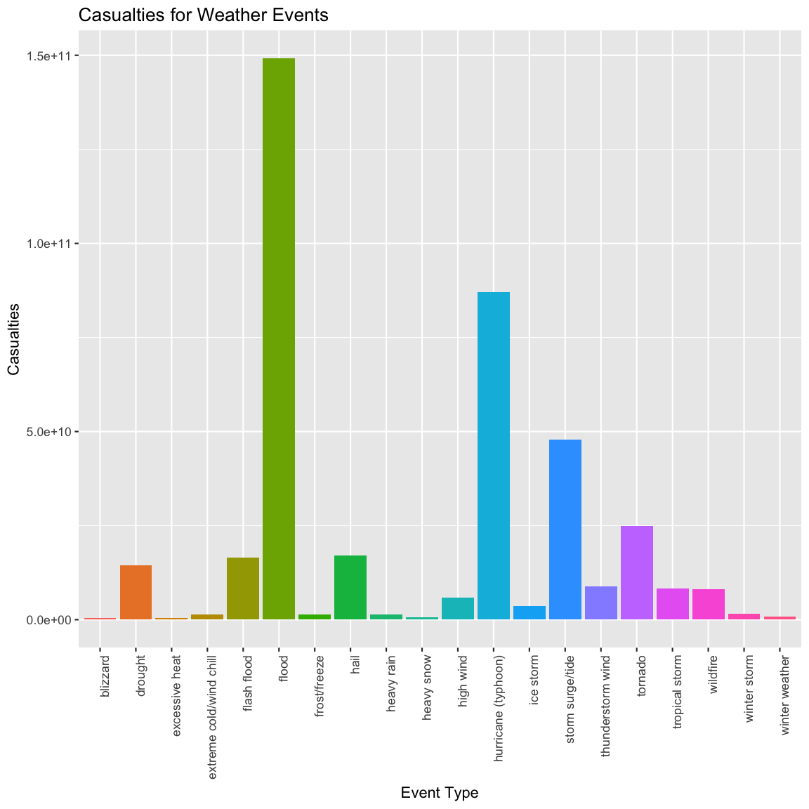

Reproducible Research assignment 2: Storm Data
==============================================================


# Title

## Introduction
some notes

## obtaining data
data comes from blah

```r
destfile='StormData.csv.bz2'
if (! file.exists(destfile))
{
    download.file('https://d396qusza40orc.cloudfront.net/repdata%2Fdata%2FStormData.csv.bz2',dest=destfile,method='curl')
}
stormData<-read.csv('./StormData.csv.bz2',stringsAsFactors=FALSE)

head(stormData)
```

```
##   STATE__           BGN_DATE BGN_TIME TIME_ZONE COUNTY COUNTYNAME STATE
## 1       1  4/18/1950 0:00:00     0130       CST     97     MOBILE    AL
## 2       1  4/18/1950 0:00:00     0145       CST      3    BALDWIN    AL
## 3       1  2/20/1951 0:00:00     1600       CST     57    FAYETTE    AL
## 4       1   6/8/1951 0:00:00     0900       CST     89    MADISON    AL
## 5       1 11/15/1951 0:00:00     1500       CST     43    CULLMAN    AL
## 6       1 11/15/1951 0:00:00     2000       CST     77 LAUDERDALE    AL
##    EVTYPE BGN_RANGE BGN_AZI BGN_LOCATI END_DATE END_TIME COUNTY_END
## 1 TORNADO         0                                               0
## 2 TORNADO         0                                               0
## 3 TORNADO         0                                               0
## 4 TORNADO         0                                               0
## 5 TORNADO         0                                               0
## 6 TORNADO         0                                               0
##   COUNTYENDN END_RANGE END_AZI END_LOCATI LENGTH WIDTH F MAG FATALITIES
## 1         NA         0                      14.0   100 3   0          0
## 2         NA         0                       2.0   150 2   0          0
## 3         NA         0                       0.1   123 2   0          0
## 4         NA         0                       0.0   100 2   0          0
## 5         NA         0                       0.0   150 2   0          0
## 6         NA         0                       1.5   177 2   0          0
##   INJURIES PROPDMG PROPDMGEXP CROPDMG CROPDMGEXP WFO STATEOFFIC ZONENAMES
## 1       15    25.0          K       0                                    
## 2        0     2.5          K       0                                    
## 3        2    25.0          K       0                                    
## 4        2     2.5          K       0                                    
## 5        2     2.5          K       0                                    
## 6        6     2.5          K       0                                    
##   LATITUDE LONGITUDE LATITUDE_E LONGITUDE_ REMARKS REFNUM
## 1     3040      8812       3051       8806              1
## 2     3042      8755          0          0              2
## 3     3340      8742          0          0              3
## 4     3458      8626          0          0              4
## 5     3412      8642          0          0              5
## 6     3450      8748          0          0              6
```

## Data Processing

The Event type code (EVTYPE) is important, as it will be used to categorise the data. Unfortunately, there are many errors and inconsistencies in the raw data. For example:

```r
length(unique(stormData$EVTYPE))
```

```
## [1] 985
```

```r
moose<-unique(tolower(stormData$EVTYPE))
length(moose)
```

```
## [1] 898
```

```r
moose[grep('aval',moose)]
```

```
## [1] "avalanche"                     "avalance"                     
## [3] "heavy snow/blizzard/avalanche"
```

```r
sum(grepl('tstm',moose))
```

```
## [1] 29
```

```r
sum(grepl('thunderstorm',moose))
```

```
## [1] 81
```

There are 87 event types that differ only in the case (upper or lower) of their lettering, 'avalanche' is missspelled at least once, and high winds may be categorised as something like 'tstm wind' or 'thunderstorm wind', with variations based on wind speeds/gust speeds. All of these variations make it difficult to compare weather events. According to the [instructions](https://d396qusza40orc.cloudfront.net/repdata%2Fpeer2_doc%2Fpd01016005curr.pdf) on storm data preparation, there are only 48 allowed event types, which are listed below: 

- Astronomical Low Tide 
- Avalanche 
- Blizzard 
- Coastal Flood 
- Cold/Wind Chill 
- Debris Flow 
- Dense Fog 
- Dense Smoke 
- Drought 
- Dust Devil 
- Dust Storm 
- Excessive Heat 
- Extreme Cold/Wind Chill 
- Flash Flood 
- Flood 
- Frost/Freeze 
- Funnel Cloud 
- Freezing Fog 
- Hail 
- Heat 
- Heavy Rain 
- Heavy Snow 
- High Surf 
- High Wind 
- Hurricane (Typhoon)
- Ice Storm 
- Lake-Effect Snow 
- Lakeshore Flood 
- Lightning 
- Marine Hail 
- Marine High Wind 
- Marine Strong Wind 
- Marine Thunderstorm Wind 
- Rip Current 
- Seiche 
- Sleet 
- Storm Surge/Tide 
- Strong Wind 
- Thunderstorm Wind 
- Tornado 
- Tropical Depression 
- Tropical Storm 
- Tsunami 
- Volcanic Ash 
- Waterspout 
- Wildfire 
- Winter Storm 
- Winter Weather


The raw data will need to be tidied before it can be processed effectively. First the observations (rows) of interest will be selected (as this will limit the range of EVTYPE codes that need to be corrected), and then regular expressions will be used to correct the event type codes to one of the 48 options listed above.

based on [this post](https://www.coursera.org/learn/reproducible-research/discussions/weeks/4/threads/IdtP_JHzEeaePQ71AQUtYw) in the course discussion forums, it was only after January 1996 that NOAA started recording events of all types. Tornado data was present from the beginning (1950), but other types of weather events were reported and recorded later. Data prior to January 1996 will be omitted, as analysis of this data could introduce bias due to lack of records on certain weather types.


```r
library(dplyr)
stormData$BGN_DATE<-as.Date(stormData$BGN_DATE,format='%m/%d/%Y')
storm96<-stormData %>% filter(BGN_DATE >  '1996-01-01')
```
Crop and property damage are stored strangely, with the first few significant digits stored seperately from the dollar exponent.** blah blah **


```r
storm96$CropDamage<-storm96$CROPDMG
levels(as.factor(storm96$CROPDMGEXP) )
```

```
## [1] ""  "B" "K" "M"
```

```r
# scale crop damage
thelist<-with(storm96, CROPDMGEXP=='B')
storm96$CropDamage[thelist]<-storm96$CropDamage[thelist]*1.0e9
thelist<-with(storm96, CROPDMGEXP=='K' )
storm96$CropDamage[thelist]<-storm96$CropDamage[thelist]*1.0e3
thelist<-with(storm96, CROPDMGEXP=='M')
storm96$CropDamage[thelist]<-storm96$CropDamage[thelist]*1.0e6

# scale property damage
storm96$PropDamage<-storm96$PROPDMG
levels(as.factor(storm96$PROPDMGEXP) )
```

```
## [1] ""  "0" "B" "K" "M"
```

```r
thelist<-grepl('[bB]',storm96$PROPDMGEXP)
storm96$PropDamage[thelist]<-storm96$PropDamage[thelist]*1.0e9
thelist<-grepl('[mM]',storm96$PROPDMGEXP)
storm96$PropDamage[thelist]<-storm96$PropDamage[thelist]*1.0e6
thelist<-grepl('[kK]',storm96$PROPDMGEXP)
storm96$PropDamage[thelist]<-storm96$PropDamage[thelist]*1.0e3

# slim data based on injuries, fatalities, and property/crop damage
slim96<- storm96 %>% select(BGN_DATE,EVTYPE,PropDamage,CropDamage,INJURIES,FATALITIES,LATITUDE,LONGITUDE) %>%
filter(PropDamage>0 | CropDamage >0 | INJURIES >0 | FATALITIES >0)
length(unique(slim96$EVTYPE))
```

```
## [1] 222
```
Right now there are 222 event types. Start by casting everything to lower case, and by removing any leading whitespace


```r
slim96$EventType<-tolower(slim96$EVTYPE)
# trimws is new? doesn't exist in older R versions
#slim96$EventType<-trimws(slim96$EventType)
slim96$EventType<-gsub('^\\s+|\\s+$','',slim96$EventType)
length(unique(slim96$EventType))
```

```
## [1] 183
```

Start Reclassifying things/filtering things

```r
# remove things that can't be reclassified easily
badcodes<-c("astronomical high tide","other","marine accident", "coastal storm","coastalstorm","beach erosion","glaze","mixed precip","dam break","coastal erosion" )
slim96<- slim96 %>% filter(! (EventType  %in% badcodes))

# change non thunderstorm winds to strong winds
slim96$EventType<-gsub('non[ -]tstm wind','strong wind',slim96$EventType)
length(unique(slim96$EventType))
```

```
## [1] 171
```

```r
#change tstm/thunderstorm wind to thunderstorm wind
change<-with(slim96, (grepl('tstm',EventType) | grepl('thunderstorm',EventType)) & grepl('wind',EventType))
slim96$EventType[change]<-'thunderstorm wind'
length(unique(slim96$EventType))
```

```
## [1] 157
```

```r
# change 'blowing dust' to dust devil
slim96[slim96$EventType=='blowing dust','EventType']<-'dust devil'
length(unique(slim96$EventType))
```

```
## [1] 156
```

```r
#change mudslide or similar to debris flow
slim96$EventType<-gsub('mud[ -]?slides?','debris flow',slim96$EventType)
length(unique(slim96$EventType))
```

```
## [1] 154
```

```r
# change any remaining occurences of "coastal" to coastal flood
slim96[grepl('coastal|tidal|cstl',slim96$EventType),'EventType'] <-'coastal flood'
length(unique(slim96$EventType))
```

```
## [1] 149
```

```r
# change (non extreme) cold to cold/windchill
slim96[grepl('cold|thermia',slim96$EventType) & (! grepl('extreme',slim96$EventType)),'EventType'] <-'cold/wind chill'

# extreme cold
slim96$EventType[grepl('extreme',slim96$EventType)] <-'extreme cold/wind chill'

# land or rock slides to debris flow
slim96$EventType[grepl('landsl|rock',slim96$EventType)] <-'debris flow'

# fog to dense fog
slim96[grepl('fog',slim96$EventType),'EventType'] <-'dense fog'

# blowing dust or whirlwind to dust devil
slim96$EventType[grepl('whirl|dust',slim96$EventType)]<-'dust devil'

length(unique(slim96$EventType))
```

```
## [1] 130
```

```r
# record heat to excessive heat
slim96$EventType[grepl('record heat',slim96$EventType)]<-"excessive heat"

# flash floods
slim96$EventType[grepl('flash',slim96$EventType)]<-"flash flood"

# non flash floods
slim96$EventType[grepl('high water|flood|fld',slim96$EventType) & (! grepl('flash|coastal',slim96$EventType))]<-"flood"

# frost/freeze
slim96$EventType[grepl('agric|black|road|free?z|frost',slim96$EventType) ]<-"frost/freeze"

# "landspout"
slim96$EventType[grepl('landspout',slim96$EventType)]<-"funnel cloud"

# hail
slim96$EventType[grepl('hail',slim96$EventType)]<-"hail"

# excessive heat
slim96$EventType[grepl('record',slim96$EventType)]<-"excessive heat"

# regular heat
slim96$EventType[grepl('heat|warm',slim96$EventType) & (! grepl('excessive',slim96$EventType))]<-"heat"

# rain (not gusty or freezing)
slim96$EventType[grepl('rain',slim96$EventType) & (! grepl('wind|freez',slim96$EventType))]<-"heavy rain"

# lake effect snow
slim96$EventType[grepl('lake effect snow',slim96$EventType)]<-"lake-effect snow"

# winter weather
slim96$EventType[grepl('blowing|falling|light|mix',slim96$EventType)]<-"winter weather"

# heavy snow
slim96$EventType[grepl('snow',slim96$EventType) & (! grepl('lake',slim96$EventType))]<-"heavy snow"

# high surf
slim96$EventType[grepl('surf|sea|wave|swell',slim96$EventType)]<-"high surf"

# high wind
slim96$EventType[grepl('grad|high wind',slim96$EventType)]<-"high wind"

# strong wind
slim96$EventType[grepl('gust|wind damage',slim96$EventType)]<-"strong wind"
slim96$EventType[ slim96$EventType =='wind' ]<-'strong wind'
slim96$EventType[ slim96$EventType=='winds']<-'strong wind'
slim96$EventType[ slim96$EventType== 'strong winds']<-'strong wind'

# hurricane (typhoon)
slim96$EventType[grepl('hurricane|typhoon',slim96$EventType)]<-"hurricane (typhoon)"

# rip currents (assume that drowning belongs here)
slim96$EventType[grepl('rip current|drown',slim96$EventType)]<-"rip current"

# storm surge
slim96$EventType[grepl('storm surge',slim96$EventType)]<-"storm surge/tide"

# thunderstorm winds - microbursts/downbursts are often associated with thunderstorms, so we include those here (wikipedia)
slim96$EventType[grepl('burst',slim96$EventType)]<-'thunderstorm wind'
slim96$EventType[ slim96$EventType== 'thunderstorm']<-'thunderstorm wind'

# wildfire
slim96$EventType[grepl('fire',slim96$EventType)]<-'wildfire'

moose<-unique(slim96$EventType)
moose[order(moose)]                  
```

```
##  [1] "astronomical low tide"   "avalanche"              
##  [3] "blizzard"                "coastal flood"          
##  [5] "cold/wind chill"         "debris flow"            
##  [7] "dense fog"               "dense smoke"            
##  [9] "drought"                 "dust devil"             
## [11] "excessive heat"          "extreme cold/wind chill"
## [13] "flash flood"             "flood"                  
## [15] "frost/freeze"            "funnel cloud"           
## [17] "hail"                    "heat"                   
## [19] "heavy rain"              "heavy snow"             
## [21] "high surf"               "high wind"              
## [23] "hurricane (typhoon)"     "ice storm"              
## [25] "lake-effect snow"        "marine strong wind"     
## [27] "rip current"             "seiche"                 
## [29] "storm surge/tide"        "strong wind"            
## [31] "thunderstorm wind"       "tornado"                
## [33] "tropical depression"     "tropical storm"         
## [35] "tsunami"                 "volcanic ash"           
## [37] "waterspout"              "wildfire"               
## [39] "winter storm"            "winter weather"
```

following event codes are absent from the data:
 1. dust storm
 2. freezing fog
 3. lakeshore flood
 4. lightning
 5. marine hail
 6. marine high wind
 7. marine thunderstorm wind
 8. sleet


## Results

What are the costliest (individual) events?

```r
slim96$TotalDamage<-slim96$CropDamage + slim96$PropDamage
slim96 %>% select(BGN_DATE,EventType,TotalDamage,LATITUDE,LONGITUDE) %>% arrange(desc(TotalDamage)) %>% head(n=10)
```

```
##      BGN_DATE           EventType  TotalDamage LATITUDE LONGITUDE
## 1  2006-01-01               flood 115032500000     3828     12218
## 2  2005-08-29    storm surge/tide  31300000000        0         0
## 3  2005-08-28 hurricane (typhoon)  16930000000        0         0
## 4  2005-08-29    storm surge/tide  11260000000        0         0
## 5  2005-10-24 hurricane (typhoon)  10000000000        0         0
## 6  2005-08-29 hurricane (typhoon)   7390000000        0         0
## 7  2005-08-28 hurricane (typhoon)   7350000000        0         0
## 8  2004-08-13 hurricane (typhoon)   5705000000        0         0
## 9  2001-06-05      tropical storm   5150000000        0         0
## 10 2004-09-04 hurricane (typhoon)   4923200000        0         0
```
https://www.ncdc.noaa.gov/billions/events - the 150 billion flood is prolly related to Hurricane Katrina.


```r
library(ggplot2)
library(dplyr)
```

```
## 
## Attaching package: 'dplyr'
```

```
## The following objects are masked from 'package:stats':
## 
##     filter, lag
```

```
## The following objects are masked from 'package:base':
## 
##     intersect, setdiff, setequal, union
```

```r
AggStorms<- slim96 %>% select(EventType,TotalDamage,FATALITIES,INJURIES) %>% group_by(EventType) %>% 
summarise_each(funs(sum),TotalDamageSum=TotalDamage,TotalInjuries=INJURIES,TotalFatalities=FATALITIES)

damageStorms<- AggStorms %>% filter(TotalDamageSum >0 )

g<-ggplot(data=damageStorms,aes(x=EventType,y=TotalDamageSum,fill=EventType))
g+ geom_bar(stat='identity') + theme(axis.text.x = element_text(angle = 90, hjust = 1)) + guides(fill=FALSE)
```


```r
library(ggplot2)
library(dplyr)
#slim96$TotalDamage<-slim96$CropDamage + slim96$PropDamage

#damageStormsa<- AggStorms %>% filter(TotalDamageSum >0 )

g<-ggplot(data=slim96["TotalDamage" > 0,] ,aes(x=EventType,y=TotalDamage), log='y')
g+ geom_point(colour='red') + theme(axis.text.x = element_text(angle = 90, hjust = 1))
```




questions: what event types are worst for population health
panel plot fatalities vs magnitude, colour = evtype
injuries vs magnitude, colour = evetype

what storms do most damage/are most expensive
plot propdamageexp vs magnitude, colour = eventtype

where do these occur most
plot lat and long, colour = mag, on a map of US


